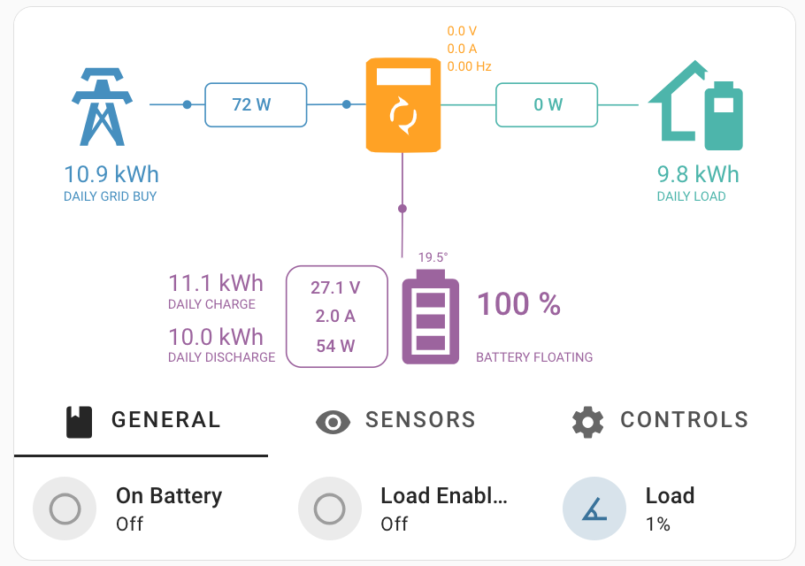
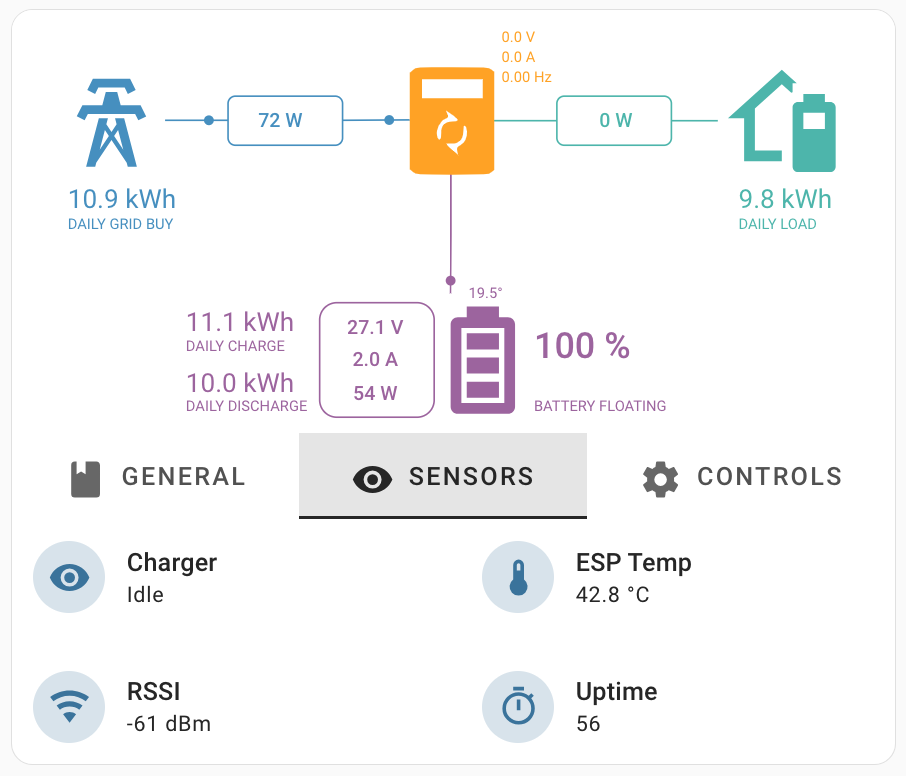
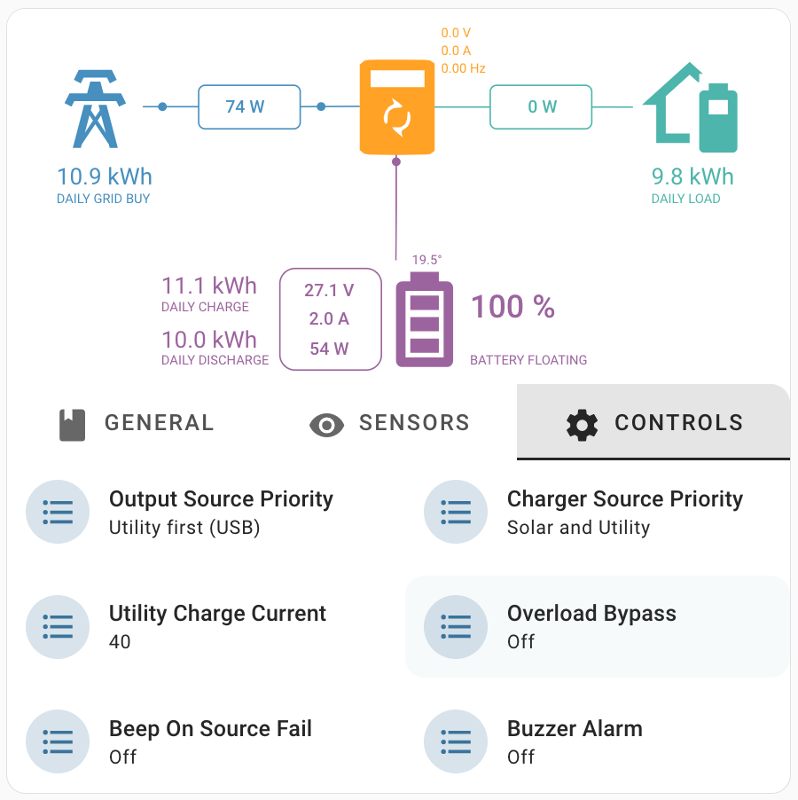

# ESPHome PowMr Hybrid Inverter
ESPHome config for various PowMr Hybrid Inverter models.

## Compatibility
All models that are supported by the [**WIFI-VM**](https://powmr.com/products/powmr-wifi-module-with-rs232-remote-monitoring-solution-wifi-vm) device should work:

- [**POW-HVM1.5H-12V**](https://powmr.com/products/all-in-one-inverter-charger-1500watt-220vac-12vdc)
- **POW-HVM2.0H-12V**
- [**POW-HVM2.4H-24V**](https://web.archive.org/web/20230329235125/https://powmr.com/inverters/all-in-one-inverter-chargers/powmr-2400watt-dc-24v-ac-220v-solar-inverter-charger)
- [**POW-HVM3.2H-24V**](https://powmr.com/products/all-in-one-inverter-charger-3000w-220vac-24vdc)
- [**POW-HVM3.6M-24V**](https://powmr.com/products/hybrid-inverter-charger-3600w-220vac-24vdc)
- [**POW-HVM4.2M-24V**](https://powmr.com/products/hybrid-inverter-charger-4200w-220vac-24vdc)
- [**POW-HVM6.2M-48V**](https://powmr.com/products/hybrid-inverter-charger-6200w-220vac-48vdc)
- [**POW-HVM8.2M**](https://powmr.com/products/hybrid-inverter-charger-8000w-220vac-48vdc)
- [**POW-HVM10.2M**](https://powmr.com/products/hybrid-inverter-charger-10200w-200vac-48vdc)

### Tested models

- **POW-HVM2.4H-24V**
- **POW-HVM10.2M**

## Connection


## ESP8266
This configuration can be used on the ESP8266, but you won't be able to use all the sensors due to the memory limitations of the ESP8266. 
You can use minimal set of sensors/selects, leaving only the ones you need. You can use "Heap size" sensor of Debug module to determine how much free memory left. 
Looks like minimum heap size, that ensures stability, is near 6Kb. Although I still strongly recommend using ESP32.

## Usage
1) Create new project subdirectory within your ESPHome configuration directory (let it be `powmr-inverter`, for example) 
2) Copy the contents of the `src` repo folder to a newly created project directory.
3) Now, the `main.yaml` file must be located under `<esphome_config>/powmr-inverter`
4) Create file `powmr-inverter.yaml` in the esphome config directory root and copy contents of [example config](/examples/powmr-inverter.yaml)
5) Edit substitutions & customize `powmr-inverter.yaml`. You can add contents of [common_system](/examples/common_system.yaml) & [common_sensors](/examples/common_sensors.yaml) to this file or include them separately following the example.
6) Flash firmware to your ESP32

## PCB`s
There are 2 versions of PCB design available. Advanced version is more compact but needs SMD soldering skills, basic version uses 2.54 parts & modular approach. 
- Docs for [Basic PCB](pcb/basic/README.md)
- Docs for [Advanced PCB](pcb/advanced/README.md) by [@davidebeatrici](https://github.com/davidebeatrici)

## PZEM module
In version 1.2, a [PZEM](https://esphome.io/components/sensor/pzem004t) module was added for measuring parameters of the input AC grid. If you do not wish to use it, comment out the include of the corresponding module in the [main.yaml](/src/main.yaml) file.

## Inverter card
For easy integration into Home Assistant, you can use the [following snippet](/examples/inverter-card-example.yaml). It compiles all the essential inverter sensors and controls in a compact manner. 
The following custom plugins are required: [sunsynk-power-flow-card](https://github.com/slipx06/sunsynk-power-flow-card), [stack-in-card](https://github.com/custom-cards/stack-in-card), [tabbed-card](https://github.com/kinghat/tabbed-card), [canary](https://github.com/jcwillox/lovelace-canary).

<table border="0">
<tr>
<td valign="top"></td>
<td valign="top"></td>
<td valign="top"></td>
</tr>
</table>

## Optimize modbus communications
ESPHome reads sequential Modbus registers in one batch. If you have gaps in register addresses, you need to use the `register_count` parameter to skip N registers and continue the batch.
[Details in ESPHome docs](https://esphome.io/components/sensor/modbus_controller#modbus-register-count).

You can debug your register ranges by setting the global log level to `VERBOSE` and muting all "noisy" components except the `modbus_controller`.
```yaml
logger:
  level: VERBOSE
  logs:
    component: ERROR # Fix for issue #4717 "Component xxxxxx took a long time for an operation"
    modbus_controller: VERBOSE
    modbus_controller.text_sensor: WARN
    modbus_controller.sensor: WARN
    modbus_controller.binary_sensor: WARN
    modbus_controller.select: WARN
```
After this, the ranges map will be printed in the logs:
```text
[15:55:14][C][modbus_controller:307]: ranges
[18:41:21][C][modbus_controller:307]: ranges
[18:41:21][C][modbus_controller:310]:   Range type=3 start=0x1196 count=37 skip_updates=0
[18:41:21][C][modbus_controller:310]:   Range type=3 start=0x11BC count=16 skip_updates=0
[18:41:21][C][modbus_controller:310]:   Range type=3 start=0x138A count=1 skip_updates=2
[18:41:21][C][modbus_controller:310]:   Range type=3 start=0x138F count=1 skip_updates=2
[18:41:21][C][modbus_controller:310]:   Range type=3 start=0x1391 count=1 skip_updates=2
[18:41:21][C][modbus_controller:310]:   Range type=3 start=0x1399 count=1 skip_updates=2
[18:41:21][C][modbus_controller:310]:   Range type=3 start=0x139A count=1 skip_updates=2
[18:41:21][C][modbus_controller:310]:   Range type=3 start=0x139E count=1 skip_updates=2
[18:41:21][C][modbus_controller:310]:   Range type=3 start=0x13A0 count=1 skip_updates=2
```
> *In the example above, the sensor registers batches starts from `0x1196` & `0x11BC` (one large batch causes data errors). Select registers starts from `0x138A`.*
> *Using batches for selects triggers `Modbus device set offline` warning messages, so you need to read them separately.*

You will see gaps in register ranges map. To calculate `register_count`, you need to convert HEX addresses to decimal and subtract them.

## UART debugging
- Uncomment debug section in [modules/inverter.yaml](/src/modules/inverter.yaml) or [modules/pzem.yaml](/src/modules/pzem.yaml) to enable the debug output of the UART component 
  ```
    # debug:
    #   direction: BOTH
    #   dummy_receiver: false
  ```
- Increase the log level to `DEBUG` or `VERBOSE`
  ```
  logger:
    level: WARN
  ```

## Notes
- Registers map: [registers-map.md](docs/registers-map.md)
- Read registers are using little-endian format that doesn't have a native support in ESPHome, so we need a custom function to swap bytes.
- Manuals:
  - [POW-HVM1.5H-12V](docs/POW-HVM2.4H-24V.pdf)
  - [POW-HVM2.4H-24V](docs/POW-HVM2.4H-24V.pdf)
  - [POW-HVM2.0H-12V](docs/POW-HVM3.2H-24V.pdf)
  - [POW-HVM3.2H-24V](docs/POW-HVM3.2H-24V.pdf)
  - [POW-HVM10.2M](docs/POW-HVM10.2M.pdf)

## References & thanks
- https://github.com/leodesigner/powmr_comm 
  Great research on PowMr registers and C++ firmware code with MQTT. Thanks to author, it helps me a lot.
- https://github.com/syssi/esphome-smg-ii
  ESPHome project to monitor and control a ISolar/EASUN SMG II inverter via RS232
