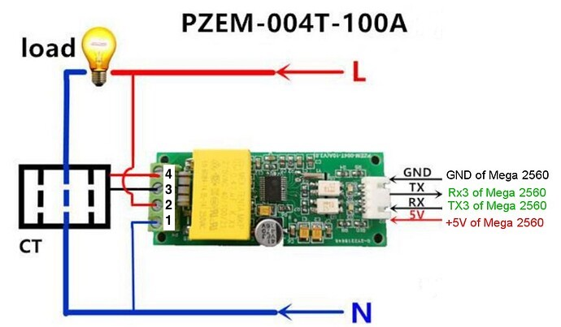
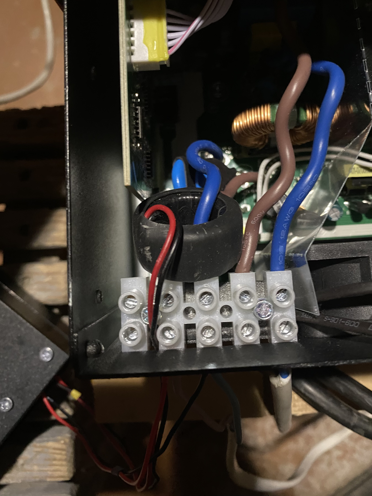
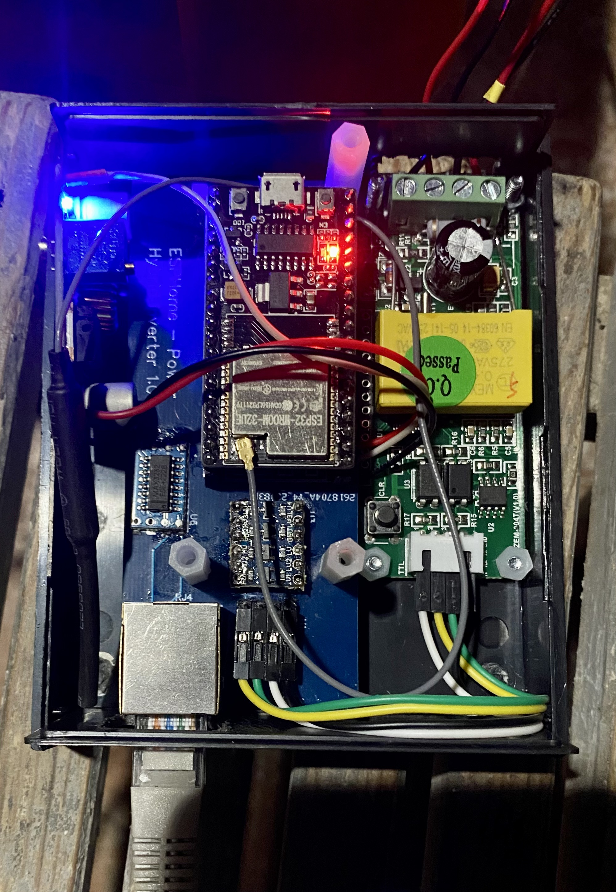

# Basic PCB

OSHWLab page: [https://oshwlab.com/ganzevich/PowMr-Hybrid-Inverter](https://oshwlab.com/ganzevich/PowMr-Hybrid-Inverter)

## PSU module connection
Using standard XL4005 module:

| Main board | XL4005 PSU        |
|------------|-------------------|
| GND pad    | PSU  ` - ` input  |
| 12V pad    | PSU `+` input     |
| 5V pad     | PSU  `+`  output  |

## PZEM module connection

| Inverter               | PZEM module |
|------------------------|-------------|
| AC IN (N)              | Pin 1       |
| AC IN (L)              | Pin 2       |
| PZEM coil (black wire) | Pin 3       |
| PZEM coil (red wire)   | Pin 4       |  

## Case examples
*Using old 1.0 board version*

## Resources
- [BOM](BOM_PowMr%20Inverter.csv)
- [Schematics](Schematic_PowMr%20Inverter.pdf)
- [Gerber](Gerber_PCB_PowMr%20Inverter.zip)
- [EasyEDA project backup](easyeda_project_backup.zip)
- PCB Top 

- PCB Bottom

