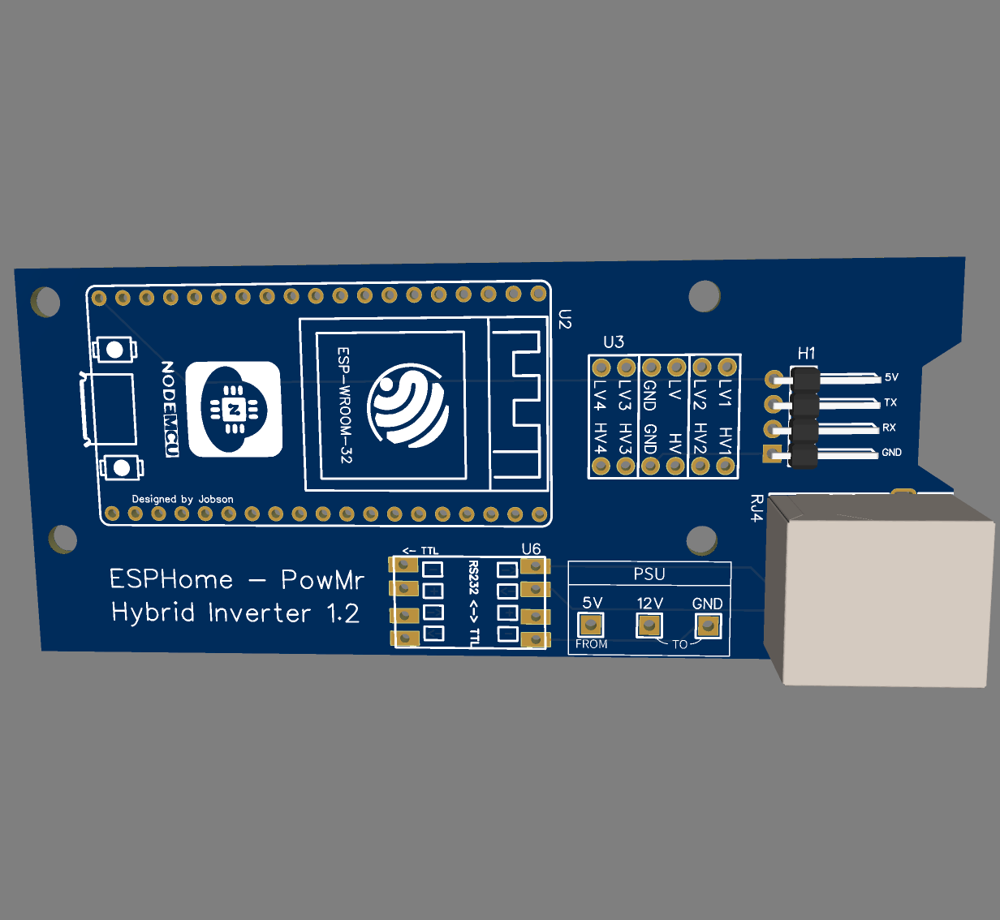
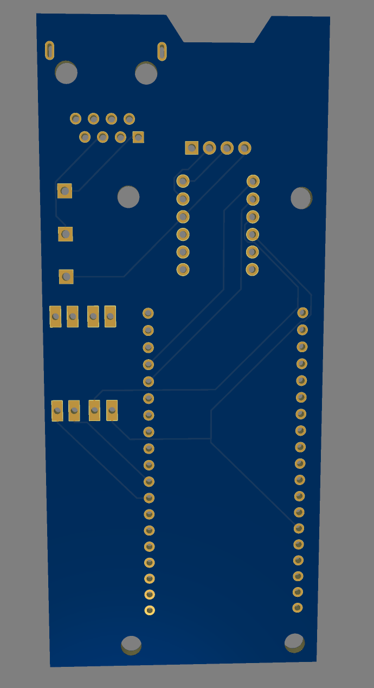

# Basic PCB

OSHWLab page: https://oshwlab.com/ganzevich/PowMr-Hybrid-Inverter

## Resources
- [BOM](BOM_PowMr%20Inverter.csv)
- [Schematics](Schematic_PowMr%20Inverter.pdf)
- [Gerber](Gerber_PCB_PowMr%20Inverter.zip)
- [EasyEDA project backup](easyeda_project_backup.zip)
- PCB Top 

- PCB Bottom

